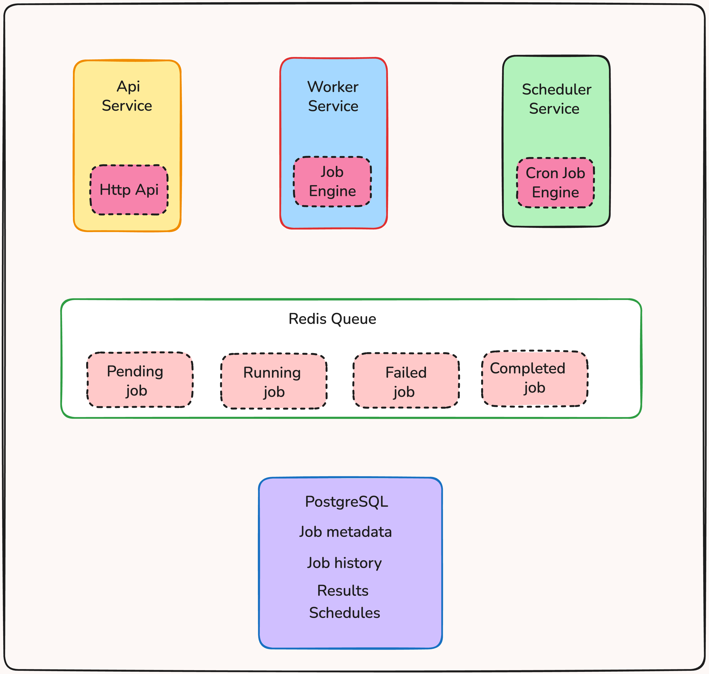

# Atlas
A distributed Job Scheduler.
A robust, scalable distributed job scheduler built in Go. This system enables applications to run background jobs reliably, asynchronously, and at scale.

## What It Does ??? 
Think of this as the engine that powers all the "behind-the-scenes" work :
- Send emails without blocking API requests
- Scrape websites 
- Many more ♥️

## Architecture


## How it works ?
``` bash 
# Submit a job
curl -X POST http://localhost:8080/jobs \
  -H "Content-Type: application/json" \
  -d '{
    "type": "email",
    "payload": {
      "to": "user@example.com",
      "subject": "Test Email",
      "body": "Hello from job scheduler!"
    }
  }'

# Check job status
curl http://localhost:8080/jobs/{job-id}

# List all jobs
curl http://localhost:8080/jobs
```
Its That Simple and easy ;) 